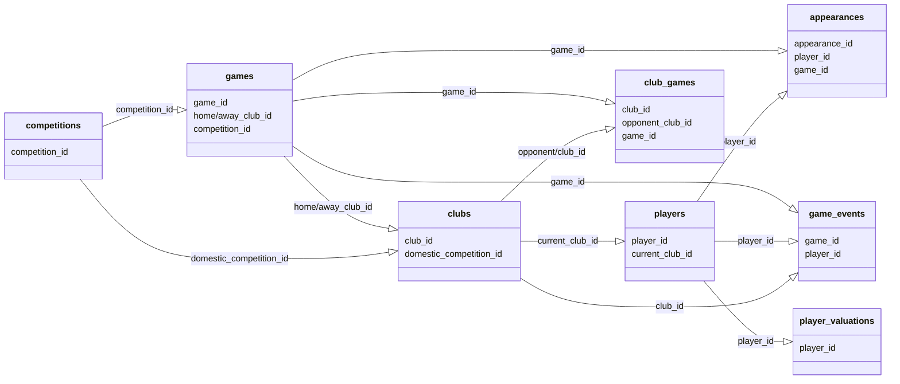

# Football Transfer Market Analysis

This project was developed as part of COSC526: Data Engineering to analyze professional football (soccer) transfer market data using Apache Spark and machine learning techniques.

## Project Overview

This analysis explores the Transfermarkt Player Scores Dataset, a comprehensive collection of football data including 60,000+ matches, 400+ clubs, 30,000+ players, and over 400,000 market valuations and 1,200,000+ player appearances.

The project focuses on:
- Transfer fee patterns and trends over time
- Club spending behavior classification
- Player performance impact on transfer values
- Prediction of missing transfer fees using machine learning


## Getting Started

### Prerequisites
- Python 3.8+
- Apache Spark 3.3+
- Jupyter Notebook
- 8GB+ RAM for processing the full dataset

### Installation

1. Clone this repository:
```bash
git clone https://github.com/yourusername/COSC526-project.git
cd COSC526-project
```

2. Install required packages:
```bash
pip install pyspark numpy pandas matplotlib seaborn tabulate findspark
```

3. Alternatively, open the project in VS Code:
    - Launch VS Code and open the `COSC526-project` folder.
    - Ensure you have the Python extension installed.
    - Use the integrated terminal to run the commands above for package installation.

4. Download the dataset: 
   - The notebook can automatically download the dataset from Kaggle, or
   - Manually download from [Kaggle: Player Scores Dataset](https://www.kaggle.com/datasets/davidcariboo/player-scores/data)
   - If downloading manually, extract the files to the `data/` directory

### Running the Analysis

1. Start Jupyter Notebook:
```bash
jupyter notebook
```

2. Open `TransferStudy.ipynb` in the browser

3. Run the notebook cells in order:
   - The first cells will handle dataset download if needed
   - Processing takes approximately 5-10 minutes depending on hardware
   - All visualizations will be generated inline

## Analysis Components

The notebook includes several key analysis components:

1. **Transfer Fee Analysis**
   - Distribution and trends
   - Seasonal comparison (summer vs. winter windows)
   - Club spending patterns

2. **Value Classification**
   - Categorizing transfers as bargains, fair value, or premium
   - K-means clustering of clubs by transfer behavior

3. **Predictive Modeling**
   - Transfer fee prediction using Random Forest
   - Enhanced model with player performance metrics
   - Ensemble methods combining multiple models

## Dataset Structure

The dataset consists of multiple CSV files with relationships shown in the diagram above:
- `appearances.csv`: Player match appearances
- `clubs.csv`: Club information
- `competitions.csv`: Competition details
- `games.csv`: Match information
- `players.csv`: Player details
- `transfers.csv`: Transfer information
- `player_valuations.csv`: Historical market valuations

The dataset provides a rich source of information for analyzing football transfer market dynamics. It includes detailed records of player appearances, club affiliations, match data, and historical market valuations. These interconnected datasets enable comprehensive insights into player performance, club strategies, and transfer fee trends.



## Results

Key findings from this analysis include:
- Identification of different club spending patterns (value buyers vs. premium spenders)
- Strong correlation between player performance metrics and transfer fees
- Successful prediction of missing transfer fees with R² values >0.7

## License

This project is provided for educational purposes. The Transfermarkt dataset is publicly available on Kaggle.

## Acknowledgments

- Dataset: [Player Scores Dataset on Kaggle](https://www.kaggle.com/datasets/davidcariboo/player-scores/data)
- University of Tennessee, Knoxville - COSC526: Data Engineering (Prof Jack Marquez and TAs)

